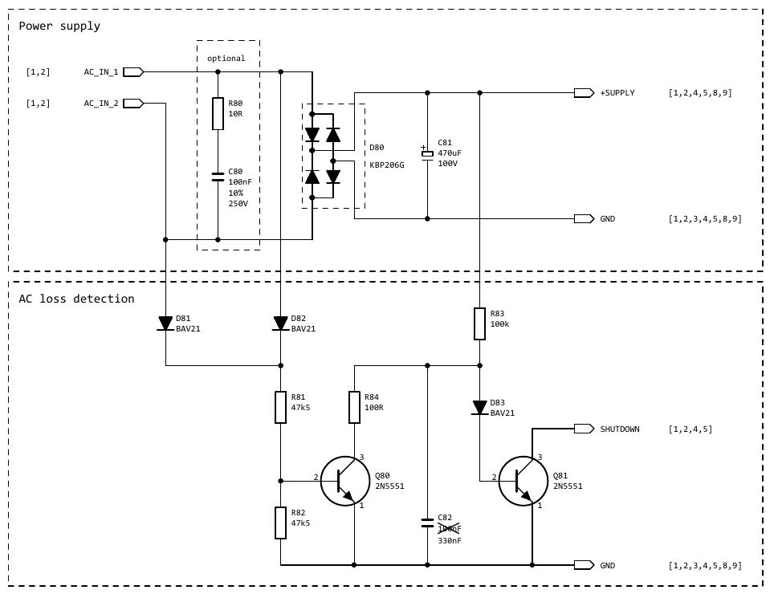
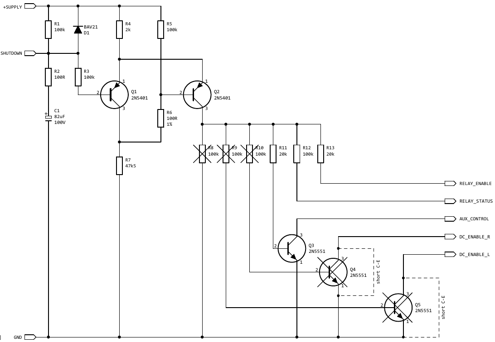
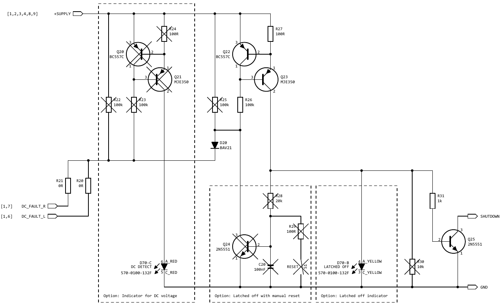
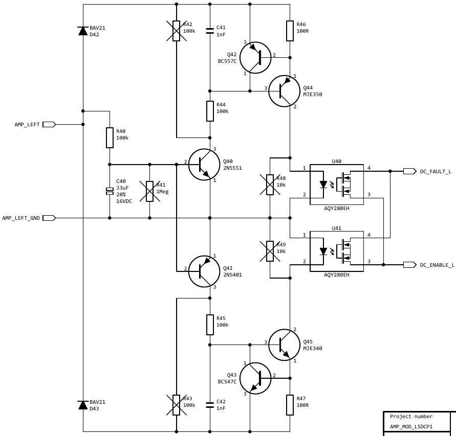
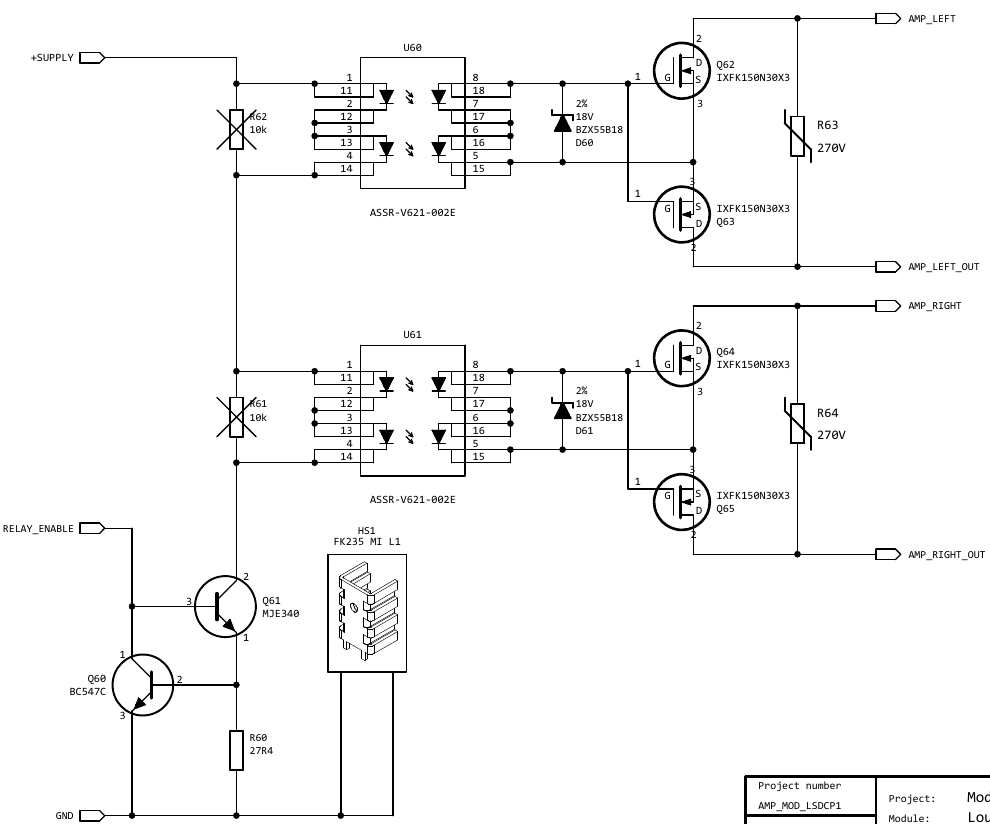
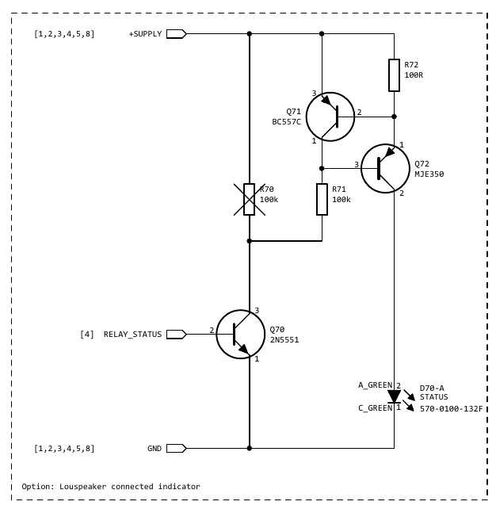

Speaker protect circuit from Lee Knatta
https://www.diyaudio.com/community/threads/improved-speaker-protection-circuit.302384/page-6

### PSU:

The power supply is just a full bridge rectifier with storage capacitor. The capacitor C81 should be large and able to withstand the voltage.
The AC loss detection uses half bridge rectifier D81 and D82 to make Q80 conduct and prevent C82 from charging up.
Once the AC fails, C82 charges through R83 and Q81 starts conducting. The "shutdown" is triggered by pulling low.

Assembly notes:
R82 is somewhat superfluous and could be left away with R81 = 100k instead. There are many such useless resistors in the design.
R84 aims to limit discharge current of C82 and may not be really necessary given that Q80 collector current is limited by the large value of R81.
R80 and C80 are optional and just a snubber for taming resonance of the transformer with the rectifier bridge. For now, I didn't install those components.

Debug:
Apply AC to the circuit and measure the supply voltage. Should be 1.4*Vac minus 1V4.
Also install (pull-up) resistor R1 (different schematic page) and measure the voltage at the "shutdown" terminal = supply voltage.
After removal of the AC, the voltage at the at the shutdown terminal should fall to 0V quickly while the supply voltage declines slowly.

### Startup Delay

Resistor R1 charges capacitor C1 until the voltage is high enough for the Schmid trigger Q1 / Q2 to change state.
R2 is just for limiting discharge current in case the "shutdown" terminal is used by external switches / relays to avoid contact damage.
I revised the resistor values around the Schmid trigger to improve low voltage operation.

Notes:
Q4 and Q5 were added to enable DC detection only after the start-up so that DC events during start-up don't trigger the circuitry. This seemed a good idea with the "latch" mode operation enabled, but is a brain fart because once a DC event occurs, the DC detection circuitry is being disabled and may not be able to discharge C1 enough. Furthermore, if the DC error persists (blown output stage) the circuitry enters a hiccup mode, which is highly undesirable. Short Q4 and Q5 as illustrated.
I came to the conclusion that the "latch" mode is not such a great idea for typical applications. More on this on another page.

Debug:
The start-up delay is roughly 12 seconds with the component values shown.
After the delay, the voltage at the collector of Q2 goes high, enabling attached circuitry (if any).
On AC loss, the voltage should go low quickly.

### Status indication and latch

You may recognize that there are two current sources that can be switched on by pulling R23 / R26 low, thus enabling the reference voltage generation of the CCS.
The DC detection connects to the left through R20 and R21.
In case of a DC event, Q20 + Q21 output a few mA into the red LED that indicates that there is a DC error at the moment.
At the same time, Q22 and Q23 output a few mA into the yellow LED and if the components around Q24 are installed, the Q22 / Q23 CCS is kept on after C20 has charged up. The circuitry around Q24 is for the latch operation and keeps the Q22 / Q23 CCS on until switch S1 resets the latch.
The whole LED indicator and latch circuitry has been helpful in the past to debug the operation, but it is kind of impractical to manually reset the circuit in case a DC event has happened. On the other hand side, such events should be very rare. Without the latch enabled, the module re-connects the loudspeaker 12 seconds after the DC error has cleared. No issues with hiccup here. LED indicators are nice, but require a lot of components.

This time, I neither wanted any LED indicators, nor latch operation and just installed R20 + R21 and wired the cathode of D20 to the collector of Q25, bypassing all the circuitry on this page.

There are two options of LED indicators (if desired):
The traffic light thee color LED that makes most sense with the latch mode and a plain red / green LED.
For the R / G LED, the red one takes the place of the yellow one, thus the Q20 / Q21 circuitry should be left away.

3 LED colors:
Green = Loudspeaker connected, everything okay
Red = Acute DC error, loudspeaker disconnected
Yellow = Acute DC error and once red is off: DC error history, loudspeaker disconnected

2 LED colors:
Green = Loudspeaker connected, everything okay
Red = Either acute DC error or DC error history, loudspeaker disconnected

### DC Detection

Here is the DC detection of the left channel. The right channel is identical.

I reverted some connections back to the initial scheme, got rid of some useless components and optimized some component values.
Note that all crossed out components are superfluous and not installed.
I believe I explained the circuit earlier, but here we go again:

Q42 / Q44 and Q43 / Q45 are just current sources, which are switched on by Q40 / Q41 if the amplifier output (left side of the schematic) is DC long enough to charge C40 through R40.
C40 should be >33uF and <56uF. I installed 56uF.
I haven't completed AC tests, thus C41 / C42 are not optimized. A few nF / tens of nF may help to avoid false triggering on high frequency signals. If optimized, this bug may be a feature for oscillation detection maybe. Simulation shows that the detection is less sensitive to high frequencies with updated component values, thus maybe it even works well without C41 / C42.
The two CCS drive current through U40 and U41, which then activate the circuitry on the previous schematic page by pulling low the "DC_FAULT" node.

Galvanic isolation of U40 / U41 is great, but has a price (commercially). There is no need for low on resistance of the opto-couplers, which allows to pick cheaper ones.

DC detection threshold is roughly 3V3. This is good because it avoids false triggering on asymmetric signals (some music may be asymmetric) and this is bad because in case the amplifier has huge DC offset, the drivers may be damaged even at low voltage. There are more sensitive DC detection circuits in case this is a concern.

### Solid state relays

Now both photovoltaic drivers are controlled by the same current source Q60 / Q61.
The current source is switched on by the Schmid trigger.
Having the drivers in series also increases the minimum supply voltage required: The module works with >6VDC.
The output voltage of the photovoltaic drivers should be 13-14V roughly.

Power MOSFETs need to be chosen according to amplifier supply voltage / power and market situation.
Vds needs to be higher than the rail to rail power supply voltage. Lowest on resistance is desirable for lowest distortion.

The 18V Zeners protect the gates and the MOVs should be rated lower than the Vds of the MOSFET.

If the module is powered with >50V roughly, Q61 should have a small radiator.

Note the symbol for U60 / U61 is weird because I designed SMD / THT combo footprint and this is why there are 16 terminals.

# OK light

This would be the optional green LED indicating that everything is okay:

Q70 switches on the CCS Q71 / Q72, which dumps a few mA through the green LED.
Nothing special.

